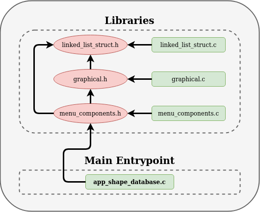
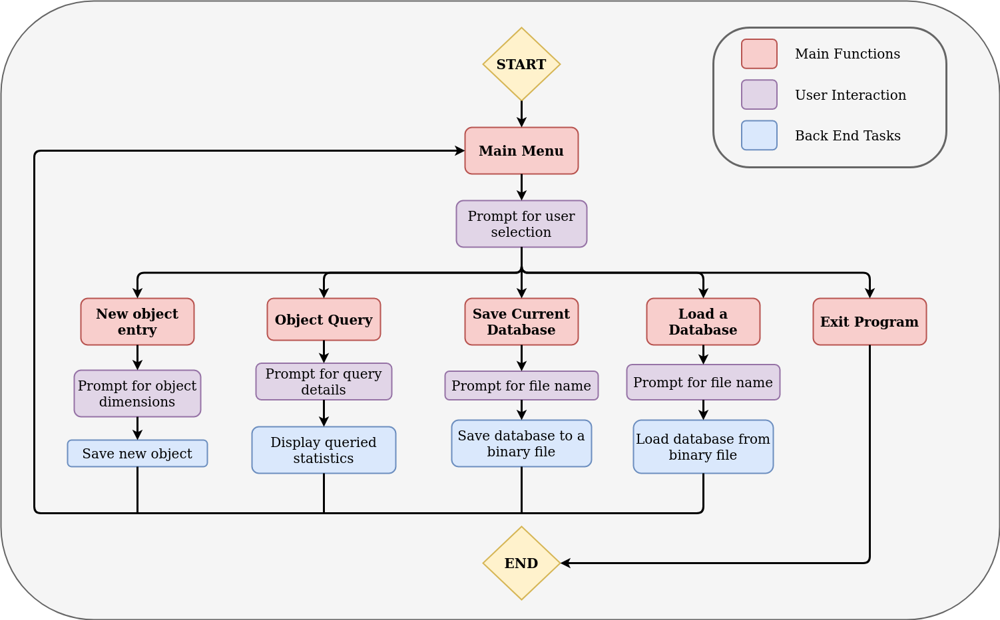

# Project Structure


# Program Logical flow


# How to compile and run the code

## Tested on ubuntu 18.04, gcc 7.5.0:
1. Clone the repository: 
```
git clone https://github.com/KeeJin/Realtime-Software-Module-Project.git
```
2. Run the bash script from within the 'scripts' folder:
```
cd Realtime-Software-Module-Project/scripts
./build_app_shape_database.sh
```
### If the bash script fails to run, you might not have the necessary execute permissions (check with ```ls -la```). If this is the issue, run: 
```
sudo chmod +x build_app_shape_database.sh
```

## Tested on Windows 10, gcc 8.1.0:
### Pre-requisites
- Powershell (to run automated script)

### Compilation and Linking
1. Navigate file "Realtime-Software-Module-Project"
2. Press shift and right-click.
3. Select "open powershell window here".
4. Run the following command to compile and build the project: 
```
& "scripts/build_app_shape_database_WINDOWS.ps1"
```

### Execution of Program
1. Navigate file "Realtime-Software-Module-Project/build/bin".
2. Open "app_main.exe"
